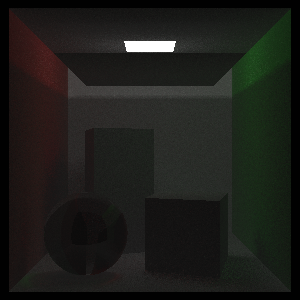

# Path tracer
Here a show some results rendered in a 300x300 resolution with 5 to 7 depth of recursion.
Using 30 paths per pixel.
I will compare a comom path tracer, a simple implementation of a bidirectional path tracer and a simple implemetentio of the Metropolis light transport.

### Results

#### Cornell box - Common Path tracer

- A cornell box with caustics on;

#### Edge case Cornell box - Common Path tracer

- A cornell box with a plane blocking the direct illumination of the light;
- Caustics on;

-----

#### Cornell box - Bidirectional path tracer

- A cornell box with caustics on;

#### Edge case Cornell box - Bidirectional path tracer

- A cornell box with a plane blocking the direct illumination of the light;
- Caustics on;

-----

#### Cornell box - Metropolis light transport

- A cornell box with caustics on;
- Using 1 to 30 permutations by path;

#### Edge case Cornell box - Metropolis light transport

- A cornell box with a plane blocking the direct illumination of the light;
- Caustics on;
- Using 1 to 30 permutations by path;

### input format
#### Spheres
```bash
s c1 c2 c3 r R G B kd ks ka kr kt p s ms ior
# s: identify a sphere
# (c1, c2, c3): the coordinates of the sphere center
# r: sphere radius
# (R, G, B): the sphere difuse color
```

-----

#### Planes
```bash
p x y z v1 v2 v3 R G B kd ks ka kr kt p s ms ior
# p: identify a plane
# (x, y, z): the coordinates of a point in the plane
# (v1, v2, v3): the coordinates of the plane normal
```

-----


#### Triangle mesh
```bash
t nt nv R G B kd ks ka kr kt p s ms ior -0 -0 -0 -0
p1x p1y p1z
p2x p2y p2z
.
.
.
pnvx pnvy pnvz
t1a t1b t1c
t2a t2b t2c
.
.
.
tnta tntb tntc
# t: identify a triangle
# (p1x, p1y, p1z) to (pnvx, pnvy, pnvz): the coordinates of the the vertices
# (t1a, t1b, t1c) to (tnta, tntb, tntc): triples of vertices indices
# -0's are discarded
```

-----


#### All previous objects:
```bash
# all the objects has the following attributes to define their material
# kd: Difuse coeficient
# ks: Specular coeficient
# ka: Ambient coeficient
# kr: Reflective coeficient
# kt: Transmission coeficient
# p:  Phong exponent
# s: boolean to tell if the object could cast shadows
# ms: boolean inside the object material to know if the material can get shadowed
# ior: refraction coeficient
```

-----


#### Lights
```bash
l l1 l2 l3 R G B s
# l: identify a light
# (l1, l2, l3): the coordinates of the light location
# (R, G, B): the light intensity
# s: boolean to tell if the light could produce shadows

l l1 l2 l3 R G B s nt nv -0 -0 os ms ns -0 -0 -0 -0
# l: identify a light
# (l1, l2, l3): the coordinates of the light location
# (R, G, B): the light intensity
# s: boolean to tell if the light could produce shadows
# os: boolean to tell if the object can cast shadows
# ms: boolean to tell if the object can get shadowed
# ns: the number of samples the light will generate
```

-----

#### Camera
```bash
c h_res v_res d up1 up2 up3 l1 l2 l3 m1 m2 m3 p s optional paths
# c: identify a camera
# h_res: horizontal resolution
# v_res: vertical resolution
# d: distance to the screen
# (up1, up2, up3): the coordinates of the up vector
# (l1, l2, l3): the coordinates of the camera location
# (m1, m2, m3): the coordintes of the location the the camera points at
# p: pixel size
# s: samples
# optional: it could be the focal plane distance or the fish eye camera max angle (from 0 to 2PI rad)
# paths: The number of rays shot per pixel
```

-----

#### Ambient:
```bash
a R G B ir depth nThreads
# (R, G, B): The ambient light color
# ir: The ambient reflectiveness coeficient
# depth: This is the depth the ray-tracer will use
# nThreads: The amount of threads used to render the scene
```